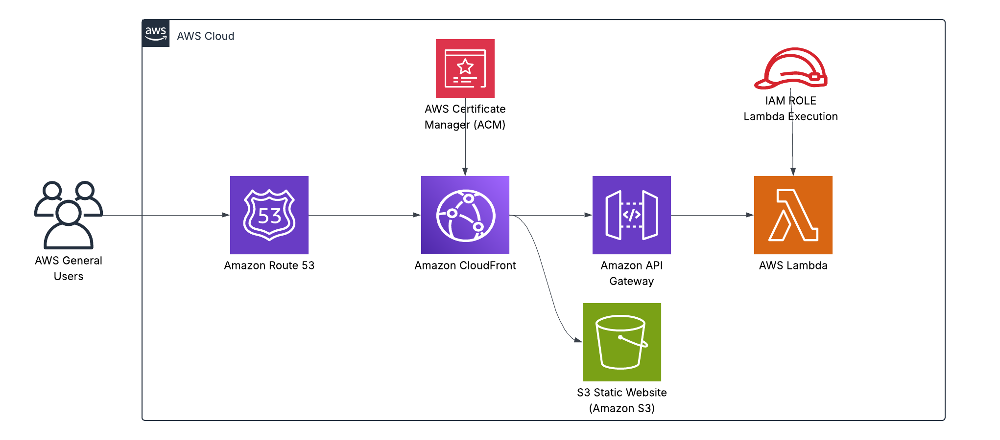

# 📬 Contact Form API – AWS S3 + Lambda + API Gateway + Route 53 + CloudFront + HTTPS

🔗 **Live Endpoint:**  
[https://ph2l1xbzrf.execute-api.us-east-1.amazonaws.com/prod/form](https://ph2l1xbzrf.execute-api.us-east-1.amazonaws.com/prod/form)

This project builds a secure, serverless contact form API using AWS Lambda and API Gateway. The API is wired to a static front-end hosted on Amazon S3 and secured via CloudFront and ACM, with DNS routing via Route 53 to the custom subdomain `form.deployjimmy.com`.

---

## ✅ Highlights

- ☁️ **AWS Lambda** – Lightweight backend for contact form processing
- 🌐 **API Gateway (HTTP API)** – REST-style endpoint at `/form`
- 🔐 **Amazon Certificate Manager** – Enforces HTTPS encryption
- 📦 **Amazon S3** – Hosts the static site front-end
- 🧭 **Route 53** – DNS routing for `form.deployjimmy.com`
- 🚀 **CloudFront** – Secures and accelerates API endpoint traffic
- 🛠️ **Manual Deployment** – Built and debugged without automation to showcase end-to-end understanding
 
---
## 📁 Project Structure

```bash
aws-s3-lambda-api-contactform/
├── architecture/              # AWS architecture diagram (PNG)
├── lambda/                    # Node.js Lambda function (API logic)
├── static-site/               # Contact form HTML and optional CSS styling
├── LICENSE
└── README.md
```

---

## 🗺️ Architecture Diagram



> 📌 *Diagram depicts HTTPS-secured traffic flow from user browser to CloudFront → API Gateway → Lambda, with DNS routing via Route 53.*

---

## 💡 Usage

To test the API directly:

```bash
curl -X POST "https://ph2l1xbzrf.execute-api.us-east-1.amazonaws.com/prod/form"   -H "Content-Type: application/json"   -d '{"name": "Jimmy", "email": "jimmy@example.com", "message": "Test from CLI"}'
```

Expected response:

```json
{ "message": "CommonJS Lambda now works!" }
```

---

## 🧠 Skills Demonstrated

- End-to-end AWS service integration
- Lambda deployment and handler debugging
- API Gateway routing and CORS configuration
- IAM role usage and log validation
- HTTPS, SSL certificate management
- CloudFront CDN configuration
- Route 53 custom domain setup
- Infrastructure troubleshooting in WSL and Windows environments

---

## 👤 Author

**Jimmy Peralta**  
🛠️ Systems Support Engineer | ☁️ AWS Cloud Enthusiast  
🌐 [https://www.deployjimmy.com](https://www.deployjimmy.com)
